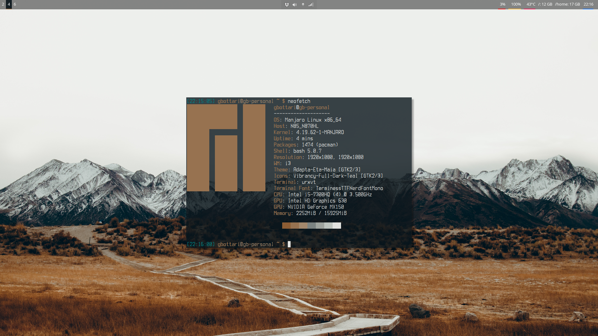

# Dotfiles

This is how I setup my programs and configurations on Linux.



This is how my setup looks like today. Nothing too fancy.

## How it works

I wanted a simple solution to configure my machines and keep them synced. What I've built here is a solution that copies files, fills templates and install programs using Ansible.

I can also have custom configurations for each machine by configuring a YAML file. For instance, I can use a different git e-mails at work and at home by configuring `gb-personal.yml` and `gbottari-work.yml`. The proper config file is selected automatically based on the machine's hostname.

## Installation

Make sure you have Ansible installed.

**on Arch:**

```bash
pacman -S ansible
```

**on Ubuntu:**

```bash
apt-add-repository ppa:ansible/ansible
apt-get update
apt-get install ansible -y
```

And then clone this repo:

```bash
git clone https://github.com/gbottari/dotfiles.git
```

Write a file on `dotfiles/vars/<your hostname>.yml` with some required configs. For instance:

```yml
- git_email: your_email@company.com
- pacman_keep_versions: 3  # how many versions should pacman keep of each package
- browser: brave  # have brave as the default browser
- machine_pkgs: [ brave ]  # extra packages to install on this machine
```

## Running

Just call `run.sh`. It will call `ansible-playbook` pointing to your config file.
